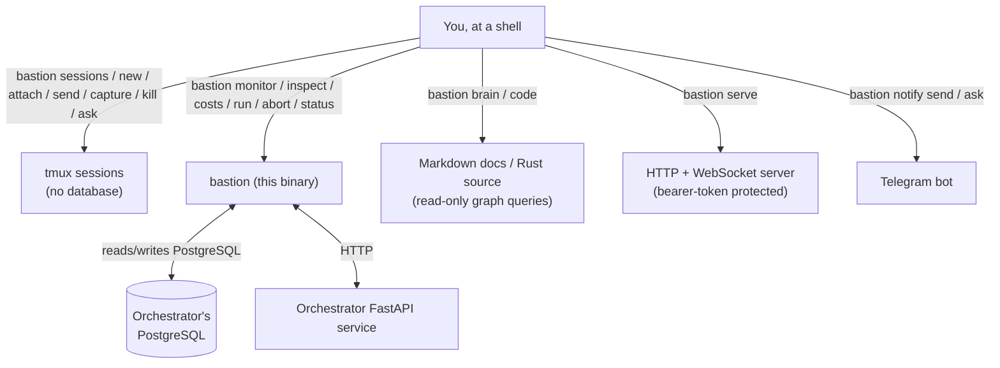

# bastion

Personal Rust CLI that acts as a unified control panel for a small agentic-engineering practice
running several other tools and projects. It has two main jobs:

- **Watch workflow runs** — a live TUI, a post-mortem view, cost reporting, and abort/trigger
  controls, backed by a companion "orchestrator" service's PostgreSQL database.
- **Control local processes** — manage [tmux](https://github.com/tmux/tmux) sessions (create,
  attach, send keystrokes, capture output) with no database involved at all.

It also carries a set of read-only "knowledge graph" queries over a Markdown documentation corpus
and over Rust source code, a small HTTP+WebSocket server, and a Telegram-based operator-notification
CLI. All of it is one binary: `bastion <subcommand>`.

> **This crate is part of a private multi-repo workspace** and depends on sibling repos via path
> dependency (`../mev`, `../okf-core`, `../bella/crates/bella-engine`, and several
> `../engine-rs/crates/*` crates). It is not designed to build standalone — cloning this repo alone
> will not compile it.

## What this is for

If you are the operator of this stack, `bastion` is how you:

- See what a running workflow is doing right now, or figure out why a finished one failed.
- Keep an eye on LLM token/dollar spend.
- Manage a fleet of tmux sessions (including ones running Claude Code) without leaving one CLI.
- Ask read-only structural questions about a documentation corpus or a Rust codebase.
- Get pinged (and ping back) over Telegram when something needs your attention.

If you are browsing this repo from the outside, it is a worked example of a Rust CLI that layers a
TUI, an HTTP server, and several "thin pass-through" subcommands (to sibling tools `mev` and
`bella`) behind one `clap` command tree.

## Quickstart

All commands below are typed in a **shell**, from inside this repo's directory (or against an
installed `bastion` binary — see [Installing](#installing)).

```bash
# 1. Build it
cargo build --release

# 2. See every subcommand and global flag
cargo run -- --help

# 3. Quick health check — no database or config required
cargo run -- status

# 4. Try the database-free surface: tmux session control
cargo run -- sessions          # list tmux sessions (empty list if you have none yet)
cargo run -- new demo          # create a detached session named "demo"
cargo run -- send demo echo hi # send a command to it without attaching
cargo run -- capture demo      # print its recent pane output
cargo run -- kill demo         # remove it
```

Nothing above needs a database. The workflow-observability commands (`monitor`, `costs`, `run`,
`abort`) need a running companion orchestrator service — see
[Prerequisites](#prerequisites) and [docs/setup.md](docs/setup.md).

### Installing

| Method | Where you type it | Notes |
|---|---|---|
| `cargo build --release` then use `target/release/bastion` | shell | Standard local build; requires the sibling repos above to be checked out as siblings of this one. |
| `cargo run -- <args>` | shell | Builds (if needed) and runs in one step; convenient for trying commands without installing. |

There is no published crate or standalone installer — this binary is built from source inside the
private workspace it lives in.

## Prerequisites

| Requirement | Needed for | If missing |
|---|---|---|
| Rust stable toolchain ([rustup](https://rustup.rs)) | Everything | `cargo build` fails to find a toolchain |
| [tmux](https://github.com/tmux/tmux) | `sessions`, `attach`, `new`, `kill`, `send`, `capture`, `ask` | Those commands error immediately — no tmux binary found |
| PostgreSQL (the companion orchestrator's database) | `monitor`, `inspect`, `costs`, `run`, `abort` | These commands fail to connect; `status` reports the DB as unreachable instead of crashing |
| The orchestrator's FastAPI service | `run`, `abort`, `monitor --workflow-id` triggers | `bastion run` cannot POST a new workflow; `status` reports the API as unreachable |
| `DATABASE_URL` in the environment (or `.env`) | Same as PostgreSQL row above | Same failure as "PostgreSQL missing" |

See [docs/setup.md](docs/setup.md) for the full end-to-end guide to standing up the companion
database and API service, and [docs/config.md](docs/config.md) for every environment variable and
the config-file format.

## How the pieces fit together



1. You run subcommands from a shell (or as a Claude Code slash command where noted below).
2. Session-control commands (`sessions`, `new`, `attach`, `send`, `capture`, `kill`, `ask`) only
   ever shell out to tmux — no database, ever.
3. Workflow-observability commands (`monitor`, `inspect`, `costs`, `run`, `abort`, `status`) read
   (and for `run`/`abort`, trigger actions on) the orchestrator's PostgreSQL database and FastAPI
   service.
4. `brain` and `code` run read-only structural queries over a Markdown documentation corpus and
   over Rust source files, respectively — no network, no database.
5. `serve` starts bastion's own HTTP+WebSocket server, separate from the orchestrator's API.
6. `notify send`/`notify ask` talk to a Telegram bot for operator notifications.

## Commands

All of these are typed in a **shell** as `bastion <subcommand>` (or `cargo run -- <subcommand>`
from source). None of them are Claude Code slash commands — this binary is a plain CLI.

### Session control (no database)

| Command | What it does |
|---|---|
| `sessions` | List tmux sessions with activity state (`running (cmd)` / `idle`) and last-line output |
| `new <session> [--dir PATH]` | Create a detached tmux session, optional working directory |
| `attach <session>` | Attach your terminal to a session (`Ctrl-b d` to detach) |
| `send <session> <cmd...>` | Send keystrokes + Enter to a session without attaching |
| `capture <session> [--lines N]` | Print a session's recent pane output without attaching |
| `kill <session>` | **Destructive** — remove a tmux session |
| `ask --session S --prompt-file P --out O [--timeout N] [--launch-cmd CMD]` | Send a prompt file to a Claude Code session running in tmux and wait for it to write an output file (creates the session if it does not exist) |
| *(no subcommand)* | Launches the interactive session dashboard (a full-screen TUI) — the default when `bastion` is run with no arguments |

### Workflow observability (needs the orchestrator's database/API — see [Prerequisites](#prerequisites))

| Command | What it does |
|---|---|
| `status` | Quick health check — orchestrator API + database reachability, no TUI |
| `monitor [--workflow-id ID] [--watch]` | Live two-pane TUI graph of active workflow runs (or a headless text loop with `--watch`); see [docs/monitor.md](docs/monitor.md) |
| `inspect <run_id>` | Static post-mortem graph view of one completed run; see [docs/inspect.md](docs/inspect.md) |
| `costs [--last 7d\|30d\|all] [--watch]` | LLM token/spend summary; see [docs/costs.md](docs/costs.md) |
| `run <workflow> [--args '{}'] [--monitor] [--force]` | Trigger a workflow via the orchestrator's API; `--force` skips the pre-dispatch budget gate; see [docs/run.md](docs/run.md) |
| `abort <run> [--yes]` | **Destructive** — stop a running workflow via the engine's abort endpoint; prompts for confirmation unless `--yes`; see [docs/abort.md](docs/abort.md) |

### Local/offline

| Command | What it does |
|---|---|
| `overview` | Workspace overview board (Kanban-style), reading local `state.json` files |
| `momentum` | Cross-repo rollup of each registered project's now/next/blocked queues and metrics, read from `status.md` files |
| `validate <path>` | Recursively validate Markdown/MDX front-matter and links under `path` (default: current directory); greppable report, non-zero exit on errors; see [docs/validate.md](docs/validate.md) |
| `assess [path] [--json]` | Read-only diagnostic over a repo: frontmatter coverage, link-graph readiness, `state.json` readiness; see [docs/assess.md](docs/assess.md) |
| `brain (--dependents\|--blast-radius\|--lineage) <NODE_ID> [--root DIR] [--workspace NAME]` | Structural queries over a Markdown documentation corpus's cross-link graph; see [docs/brain.md](docs/brain.md) |
| `code (--def\|--refs\|--dependents) <SYMBOL> [--root DIR] [--workspace NAME]` | Symbol-level queries (definitions, references, callers) over Rust source, via [tree-sitter](https://tree-sitter.github.io/tree-sitter/); coverage is `.rs` files only; see [docs/code.md](docs/code.md) |
| `view <path>` / `edit <path>` | Open a Markdown file in the companion `bella` terminal viewer/editor (both currently launch the same viewer; see [docs/docview.md](docs/docview.md)) |
| `man [--out DIR]` | Print (or write to `DIR`) a roff man page for `bastion` and every subcommand |

### Brain-ops pass-throughs (thin wrappers over a sibling tool, `mev`)

| Command | What it does |
|---|---|
| `validate-brain [path] [--links\|--structure\|--state\|--graph\|--sync] [--json]` | Validate a documentation corpus for structural/link/state consistency; flags do not compose — first one wins in this precedence order; see [docs/brainval.md](docs/brainval.md) |
| `manifest [path] [--pretty]` | Emit a JSON manifest of every file in the corpus |
| `graph [path]` | Emit the corpus's cross-reference graph as a JSON artifact |
| `emit-state [path] [--write] [--fail-on-drift]` | Derive generated state artifacts from every `state.json` found under `path`; dry-run by default — **`--write` applies the changes** |

### Server and notifications

| Command | What it does |
|---|---|
| `serve [--addr ADDR] [--token TOKEN]` | Start an HTTP+WebSocket server (default `0.0.0.0:4317`); every protected route requires a bearer token via `BASTION_SERVE_TOKEN` or `--token`; exposes a public `GET /health` and an authenticated `GET /ws`; see [docs/serve-api.md](docs/serve-api.md) |
| `notify send --text TEXT [--bot SLUG]` | Fire-and-forget plain-text Telegram message; see [docs/notify.md](docs/notify.md) |
| `notify ask --gate-id ID --summary TEXT --option key:Label [--option key:Label ...] [--timeout-secs N] [--bot SLUG]` | Ask the operator a gated question over Telegram with up to 3 response buttons, and wait for a resolving tap |

### Global flags

| Flag | What it does |
|---|---|
| `-v`, `--verbose` | Raise log verbosity to DEBUG (works before or after the subcommand) |
| `--json-logs` | Emit structured JSON log lines to stderr |
| `--build-stamp` | Print the compiled-in git SHA/dirty-flag/source-dir as JSON and exit (no subcommand needed) |

## Configuration

`bastion` resolves configuration from three layers, environment variables taking precedence:

1. Environment variables (`DATABASE_URL`, `BASTION_API_URL`, `BASTION_SERVE_TOKEN`, etc.)
2. `~/.config/bastion/config.toml` (or `$XDG_CONFIG_HOME/bastion/config.toml`)
3. Built-in defaults

A missing or unreadable config file is silently ignored. Full variable list, the config-file
format, and an example `config.toml`: [docs/config.md](docs/config.md).

## Tests

```bash
cargo test                     # run the test suite
```

The full validation gate this project runs in CI-equivalent form:

```bash
cargo fmt --check               # format gate
cargo clippy -- -D warnings     # lint gate
cargo test                      # test suite
cargo build --release           # build gate
```

## Troubleshooting

| Symptom | Likely cause | What to check |
|---|---|---|
| `monitor`/`costs`/`inspect`/`run`/`abort` fail to connect | `DATABASE_URL` unset or the orchestrator's Postgres isn't running | `bastion status`; [docs/setup.md](docs/setup.md) |
| `run`/`abort` say the API is unreachable | The orchestrator's FastAPI service isn't running | Confirm `BASTION_API_URL` and that the service process is up |
| Any of `sessions`/`attach`/`new`/`kill`/`send`/`capture`/`ask` error immediately | `tmux` is not installed or not on `PATH` | `which tmux` |
| `serve` refuses requests | Missing/incorrect bearer token | Set `BASTION_SERVE_TOKEN` or pass `--token`; only `GET /health` is unauthenticated |
| `notify send`/`notify ask` error on an unconfigured bot | The named `--bot` slug has no matching `BASTION_<SLUG>_BOT_TOKEN`/`_CHAT_ID` pair set | [docs/config.md](docs/config.md) |
| `emit-state` reports build-provenance drift | The running binary was built from an older source tree than what's on disk | Rebuild (`cargo build --release`), or see [docs/brainval.md](docs/brainval.md) |

## Documentation

Full reference docs live under [docs/](docs/) — start at [docs/index.md](docs/index.md), which
indexes all of them by surface (getting started, session control, workflow observability,
knowledge-graph queries, infrastructure).

| Doc | Contents |
|---|---|
| [docs/setup.md](docs/setup.md) | End-to-end setup: connecting bastion to the orchestrator's database |
| [docs/sessions.md](docs/sessions.md) | Session-control surface — verb reference + operator workflow |
| [docs/monitor.md](docs/monitor.md) | Live monitor — keybindings, layout, flags, degrade paths |
| [docs/config.md](docs/config.md) | Full configuration reference — every environment variable, config-file format |
| [docs/brain.md](docs/brain.md) | Documentation-corpus knowledge-graph queries |
| [docs/code.md](docs/code.md) | Rust symbol-graph queries |
| [docs/serve-api.md](docs/serve-api.md) | HTTP + WebSocket API contract for `bastion serve` |

## License

Licensed under either of

- Apache License, Version 2.0 ([LICENSE-APACHE](./LICENSE-APACHE) · <http://www.apache.org/licenses/LICENSE-2.0>)
- MIT license ([LICENSE-MIT](./LICENSE-MIT) · <http://opensource.org/licenses/MIT>)

at your option. Unless you explicitly state otherwise, any contribution intentionally submitted
for inclusion in this work by you, as defined in the Apache-2.0 license, shall be dual licensed
as above, without any additional terms or conditions.

Built for one operator and released because it may be useful to others — there is no support
obligation, no issue-response SLA, and no stability promise.
