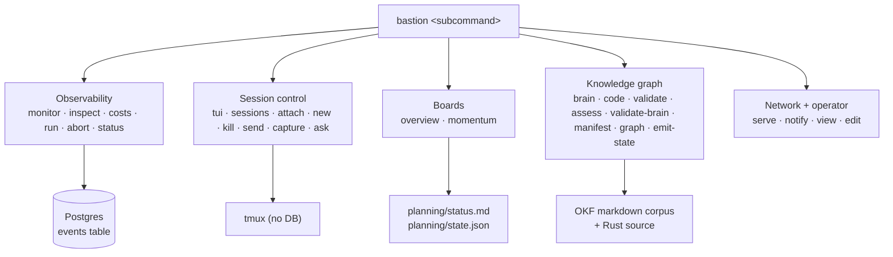

# bastion Command Catalogue

Every capability `bastion` ships, derived from the clap dispatch table in
[`src/cli.rs`](../src/cli.rs) — not from the list of docs, so a command with no doc still
shows up here. If you are looking for "what can this thing do, and how do I run it", this is
the page.

## What this page is for

`bastion` is one binary with five loosely-related jobs bolted onto it. The subcommands do not
form a single workflow, so a newcomer cannot guess the list. This page is the list, one line
each, with the run command and a link down into detail.

## Quickstart

```bash
cargo build --release              # from core/bastion/
cargo install --path .             # puts `bastion` on PATH via ~/.cargo/bin
bastion --help                     # the same catalogue, from the binary
bastion                            # no subcommand -> the interactive TUI dashboard
bastion sessions                   # a safe first command: lists tmux sessions, no DB needed
```

If `bastion: command not found` after `cargo install`, `~/.cargo/bin` is not on your PATH —
see [setup.md § Developer tooling](operations/setup.md#developer-tooling-cargobin-must-be-on-path).

**What must exist first**, by command group:

| Group | Needs | If it is missing |
|---|---|---|
| Sessions, brain-ops, docs, notify | nothing but the binary | — |
| Observability (`monitor`, `inspect`, `costs`, `status`) | `DATABASE_URL` -> a Postgres holding the `events` table | commands report the DB as unreachable; see [setup.md](operations/setup.md) |
| `run` | `BASTION_API_URL` -> the orchestrator's FastAPI | the trigger call fails; see [run.md](workflows/run.md) |
| `abort` | `bastion serve` running with `BASTION_ENGINE_API_KEY` | no abort endpoint is mounted; see [abort.md](workflows/abort.md) |
| `momentum`, `brain`, `code` | a `[workspaces]` registry in `~/.config/bastion/config.toml` | falls back to the current directory; see [config.md § Workspace registry](operations/config.md#workspace-registry) |

## The five surfaces



In sentences: `bastion` dispatches to five groups. **Observability** reads the Postgres `events`
table written by whichever stack ran the workflow. **Session control** shells out to `tmux` and
touches no database. **Boards** read planning files on disk. **Knowledge graph** parses the OKF
markdown corpus and Rust source. **Network + operator** serves the HTTP/WebSocket face and reaches
the human over Telegram.

---

## Global flags

Available on every subcommand.

| Flag | What it does |
|---|---|
| `-v`, `--verbose` | Raise log verbosity from INFO to DEBUG. Repeating it changes nothing. |
| `--json-logs` | Emit structured JSON log lines to stderr instead of human text. |
| `--build-stamp` | Print the compiled-in build provenance (`git_sha`, `dirty`, `source_dir`) as JSON and exit. Works with **no** subcommand — it is checked before dispatch. See [brainval.md](knowledge/brainval.md#--build-stamp-and-the-build-provenance-drift-guard). |
| `--version` / `--help` | clap built-ins. |

## Observability — workflow execution

Reads the Postgres `events` table (read-only; bastion never writes it — bastion decision **D2**, in `planning/decisions/`).
Needs `DATABASE_URL`.

| Command | What it does | Doc |
|---|---|---|
| `bastion monitor [-w <id>] [--watch]` | Live two-pane TUI graph of a running workflow, refreshed on the poll interval. `--watch` gives a headless plain-text loop instead. | [monitor.md](workflows/monitor.md) |
| `bastion inspect <run-id>` | Static post-mortem graph of one run. One DB load, never re-queries. | [inspect.md](workflows/inspect.md) |
| `bastion costs [--last 7d\|30d\|all] [--watch]` | LLM token spend aggregated per workflow type, with USD cost. `--watch` adds budget-threshold alerts. | [costs.md](workflows/costs.md) |
| `bastion run <workflow> [--args '{}'] [--monitor] [--force]` | Trigger a workflow through the orchestrator's FastAPI dispatcher. Passes a pre-dispatch budget gate unless `--force`. | [run.md](workflows/run.md) |
| `bastion abort <run> [--yes]` | Stop a running workflow via the Engine's `POST /events/{run_id}/abort`. **Destructive** — prompts unless `--yes`. Needs `bastion serve` up. | [abort.md](workflows/abort.md) |
| `bastion status` | One-shot plain-text stack health check: is the Postgres reachable, is the orchestrator API reachable. No TUI, no DB required to run. | [status.md](workflows/status.md) |

## Session control — tmux

DB-free by design (decision D4). Every one of these shells out to `tmux`.

| Command | What it does | Doc |
|---|---|---|
| `bastion` / `bastion tui` | Interactive session dashboard. This is what you get with no subcommand. | [sessions.md](terminal/sessions.md#unified-console-tui-dashboard) |
| `bastion sessions` | List every tmux session with its last line of pane output. | [sessions.md](terminal/sessions.md#verb-reference) |
| `bastion attach <session>` | Attach your terminal to an existing session. | [sessions.md](terminal/sessions.md#verb-reference) |
| `bastion new <session> [--dir <path>]` | Create a new detached session. | [sessions.md](terminal/sessions.md#verb-reference) |
| `bastion kill <session>` | Kill a tmux session. **Destructive**, no confirmation. Not the same as `bastion abort` — this kills a terminal, not a workflow run. | [sessions.md](terminal/sessions.md#verb-reference) |
| `bastion send <session> <cmd...>` | Send a command into a session without attaching. Multi-word, no quoting needed. | [sessions.md](terminal/sessions.md#verb-reference) |
| `bastion capture <session> [--lines N]` | Print recent pane output without attaching. | [sessions.md](terminal/sessions.md#verb-reference) |
| `bastion ask --session <s> --prompt-file <f> --out <f> [--timeout 180]` | Run one Claude Code turn inside a tmux session and wait for it to write the answer file. | [claude-code-workflow.md](terminal/claude-code-workflow.md) |

## Boards — read-only planning views

Read files on disk. Never write back — `/log-work` owns the writes (decision D25).

| Command | What it does | Doc |
|---|---|---|
| `bastion overview` | Tabbed open-work viewer over this repo's declared `[views]` sections, with in-document `[[roadmap:id]]`/`[[epic:id]]`/`[[repo:id]]` jumps. The prior Kanban `now`/`next`/`blocked` board is parked code, no longer the default. | [overview.md](boards/overview.md) *(doc pending update — see NEEDS_REVIEW)* |
| `bastion momentum` | Cross-repo rollup: the momentum queues and `## Metrics` from every registered workspace's `planning/status.md`, in one table. | [momentum.md](boards/momentum.md) |

## Knowledge graph and validation

| Command | What it does | Doc |
|---|---|---|
| `bastion brain (--dependents\|--blast-radius\|--lineage) <NODE_ID> [--json]` | Structural queries over the OKF `[[link]]` corpus: who points at this doc, what breaks if it changes, what it transitively references. `--json` emits the versioned envelope instead of greppable text — see [brain-graph-output.md](brain-graph-output.md). | [brain.md](knowledge/brain.md) |
| `bastion code (--def\|--refs\|--dependents) <SYMBOL> [--json]` | Same three questions over Rust source, via deterministic tree-sitter extraction. Rust `.rs` files only. `--json` emits the versioned envelope instead of greppable text — see [brain-graph-output.md](brain-graph-output.md). | [code.md](knowledge/code.md) |
| `bastion validate [PATH]` | Frontmatter + link validation over a markdown/MDX tree. Exits non-zero on any error. | [validate.md](knowledge/validate.md) |
| `bastion assess [PATH] [--json]` | Read-only repo diagnostic: OKF coverage, graph readiness, state readiness. Writes nothing. | [assess.md](knowledge/assess.md) |
| `bastion validate-brain [PATH] [--sync\|--graph\|--state\|--links\|--structure] [--json]` | Validate the whole company-brain corpus (`mev` pass-through). **One flag per invocation** — they do not compose. | [brainval.md](knowledge/brainval.md) |
| `bastion manifest [PATH] [--pretty]` | JSON manifest of every file in the Brain corpus (`mev` pass-through). | [brainval.md](knowledge/brainval.md) |
| `bastion graph [PATH]` | Export the `scope:doc_id` knowledge graph as JSON (`mev` pass-through). | [brainval.md](knowledge/brainval.md) |
| `bastion emit-state [PATH] [--write] [--fail-on-drift]` | Derive the generated state artifacts. Dry-run by default; **`--write` rewrites the whole corpus's generated boards**. | [brainval.md](knowledge/brainval.md) |

## Network face and operator contact

| Command | What it does | Doc |
|---|---|---|
| `bastion serve [--addr] [--token]` | Start the HTTP + WebSocket face (default `0.0.0.0:4317`, Tailscale-reachable). Mandatory bearer auth via `BASTION_SERVE_TOKEN`. Also mounts the Engine routes that `bastion abort` calls, and (BA.21.D) the attention-board notification source described below. | [serve-api.md](serve/serve-api.md) |
| `bastion notify send --text <s> [--bot lane]` | Fire-and-forget message to the operator over Telegram. No buttons, no lock. | [notify.md](serve/notify.md) |
| `bastion notify ask --gate-id <id> --summary <s> --option key:Label [--timeout-secs 300] [--bot lane]` | Ask the operator a gated question with response buttons and **block** until a resolving tap. Exit 0 answered, 2 timeout, 3 stale digest, 4 lock held. | [notify.md](serve/notify.md) |
| `bastion view <path>` | Open a markdown file in bella's terminal viewer. | [docview.md](knowledge/docview.md) |
| `bastion edit <path>` | Open a markdown file in bella's editor. Currently the same invocation as `view` — bella exposes no distinct edit flag yet. | [docview.md](knowledge/docview.md) |
| `bastion man [--out <dir>]` | Generate the roff man page. Hidden from `--help`; kept for packaging. | — |

## Fleet coordination — lane registry, leases, message queue

Thin CLI faces over `engine_core::coord::{read_coordination_view, write::*}` — the same functions
the `GET`/`POST /api/coordination/*` routes call, operating directly on the `.fleet-locks/`
directory on disk (found by walking up from `cwd` for `brain.toml`, or `FLEET_LOCK_DIR`, or
overridden per-call with `--lock-dir`). No dedicated doc page yet — see the doc comments on each
variant in [`src/cli.rs`](../src/cli.rs) for the full contract, including which verbs have a
`fleet_concurrency_check.py` counterpart and which exit codes are held in parity with it.

| Command | What it does |
|---|---|
| `bastion coord status [--json]` | Joined fleet coordination view — registry, leases, slots, messages, heartbeats, escalations, run records. `--json` is byte-equal to `GET /api/coordination`. |
| `bastion coord register --agent-name <n> --repo <r> --lane <l> --roadmap <rm> [--category <c>] [--lock-dir <p>]` | Write this lane's registry claim (and, with `--category`, its heavy-lane capacity slot). Exits 0 allowed, 3 refused at capacity — matches `fleet_concurrency_check.py register`. |
| `bastion coord heartbeat --agent-name <n> [--current-block <b>] [--block-started-at <ts>] [--lock-dir <p>]` | Re-stamp an existing registry claim's `heartbeat` field. No Python counterpart; errors (including "no existing claim") exit 1. |
| `bastion coord release --agent-name <n> [--lock-dir <p>]` | Remove a registry claim. Idempotent — exits 0 whether or not one existed, matching `fleet_concurrency_check.py release`. |
| `bastion coord lease --repo <r> --lane <l> --agent-name <n> --kind exclusive\|shared [--scope repo\|fleet] [--window <block>]... [--lane-block <block>]... [--lock-dir <p>]` | Acquire or renew an exclusive/shared claim on a repo's working tree. No Python counterpart. |
| `bastion coord unlease --repo <r> [--lock-dir <p>]` | Release the lease on `--repo`, if any. Idempotent — `removed: false` is not an error. |
| `bastion coord drain --repo <r> --lane <l> [--lock-dir <p>]` | Move every message in the lane's inbox into `processing/`. Always prints `{"moved":[...],"failed":[...]}`. |
| `bastion coord send --repo <r> --lane <l> --file <path> [--lock-dir <p>]` | Write a message envelope (read as JSON from `--file`) into the lane's inbox. Refuses any `priority`/`urgency` key up front — D43 owns priority, not the sender. |
| `bastion coord complete --repo <r> --lane <l> --message-id <id> [--lock-dir <p>]` | Move a message's file from `processing/` to `done/`, if present. Prints `{"completed":true\|false}` either way. |
| `bastion coord restore [--lock-dir <p>]` | Replay every snapshot under `.fleet-locks/.prev/` back to its original location, consuming each once. Exits 0 for both a successful replay and an ABSENT `.prev/` (no-op); exits non-zero when `.prev/` exists but is empty. |

### What reaches the phone from the attention board (BA.21.D)

`bastion serve` mounts a poller (`src/serve/attention_source/`) that shells out to `mev
attention-queue --notify-only` on a cadence and delivers the admitted items over BA.21.A's
operator transport, through the same headless question path and `PendingPayloads` registry
BA.21.C built — so an admitted item arrives as a real, answerable notification, not a
struct-to-struct assertion.

**The triage rule lives in `brain.toml`'s `[attention]` table and is applied entirely by `mev
attention-queue --notify-only` — never by bastion.** bastion only consumes the already-filtered
set; it does not re-implement, second-guess, or narrow the cut. There is exactly one place to
change what counts as notification-worthy: the `[attention]` table, not this repo. Measured
2026-09-01 on the live corpus: the full Attention board held 548 items; `--notify-only` admitted
2. A second cut implemented here would desynchronise from `/attention` the moment either side
changed — the same class of bug the digest-pinning note in `planning/blocks/BA.21.D.json` warns
about for the two independent `digest_of` implementations.

What bastion's poller *does* decide, purely from the already-admitted set: which items are new
(not already delivered, keyed on `item_id`), how many may be open at once
(`policy.operator_queue_depth`, from `engine_core::operator::queue::OperatorQueuePolicy`), and
collapsing the remainder into a single digest message rather than sending one notification per
item — including on a restart burst.

**Fail-closed, not fail-open.** If `mev` is missing, exits non-zero, or emits output that does
not parse, the poller admits *nothing* and logs a warning — it never falls back to the unfiltered
board. Admitting all 548 items because a subprocess failed would be a far worse outcome than
admitting none, and avoiding exactly that is why this source exists. The source is also
read-only end to end: no code path here opens any `state.json` for writing, matching `GET
/api/attention`'s read-only guarantee (D25).

## Not a command

Two things in `docs/` describe library surfaces, not subcommands, and cannot be invoked:

- [detect.md](terminal/detect.md) — the pure agent-state detection engine (`detect()` API + TOML manifest
  schema) used inside the session surface.
- [okf.md](knowledge/okf.md) — the `okf-core` frontmatter model, parser, and writer shared across the fleet.

## See also

- [index.md](index.md) — the full docs index, grouped by task.
- [config.md](operations/config.md) — every env var and config-file key these commands read.
- [setup.md](operations/setup.md) — first-run setup, database provisioning, PATH.
