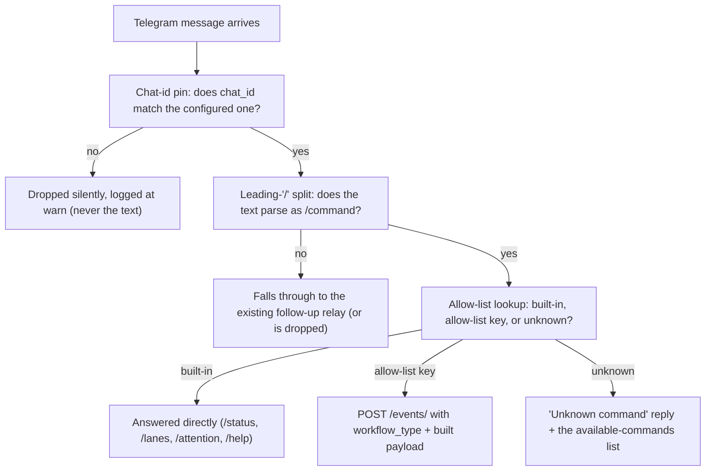

# Telegram command router

`bastion serve`'s session-QA bridge (the same Telegram loop that relays follow-up answers back
into a coding session) also answers `/command` messages sent cold, with no conversation open. A
built-in set (`/status`, `/lanes`, `/attention`, `/help`) always works. A configured
**allow-list** (`[telegram_commands]` in `config.toml`) additionally lets a chat trigger a
workflow through the same in-process `POST /events/` route `bastion serve` mounts from
engine-rs — so adding a triggerable command is a config edit, not a code change.

## Quickstart

**What must exist first:**

| Prerequisite | If missing |
|---|---|
| `BASTION_CODESESSIONS_BOT_TOKEN` + `BASTION_CODESESSIONS_CHAT_ID` (both required, both-or-neither — see [notify.md § `--bot` routing](notify.md#--bot-slug-routing)) | The session-QA bridge itself does not run; no command, built-in or configured, is answered. |
| `DATABASE_URL` + `BASTION_ENGINE_API_KEY`, **for trigger commands only** | The read-only commands (`/status`, `/lanes`, `/attention`, `/help`) still work. Every `Trigger` command replies "Failed to trigger `<TYPE>`: workflow dispatch is not configured on this bastion (engine routes not mounted this boot)" instead of running. This degradation is **invisible from the chat** unless you already know to expect it — nothing in `/help`'s output says the engine is unmounted. |

1. **Edit the config file** at `$XDG_CONFIG_HOME/bastion/config.toml`, falling back to
   `$HOME/.config/bastion/config.toml` (`config::config_path`). Add one `[telegram_commands.<name>]`
   table per command — `<name>` is what you type after the `/`, with no leading slash:

   ```toml
   [telegram_commands.research]
   workflow_type = "RESEARCH_AGENT"
   data = { mode = "company", profile = "thorough" }
   params = [{ key = "company_name", from = "rest" }]
   ```

2. **Restart `bastion serve`** — a shell command, not something typed in Telegram. The table is
   read once at boot; there is no hot reload.

   ```bash
   bastion serve   # or however your process supervisor restarts it
   ```

3. **Type the command in Telegram**, in the configured chat: `/research Acme Corp`.

## What must exist first — summary table

The chat-id pin, the config path, and the engine-mount prerequisite are all covered above. One
more thing worth stating up front: the router is **silent by design** for any chat id other than
the one configured — see [Troubleshooting](#troubleshooting).

## How a message becomes a dispatch



In sentences:

1. A message arrives on the session-QA bridge's `getUpdates` poll.
2. Its `chat_id` is compared against the configured one, **before anything else** — an
   unauthorized chat gets no reply and no log of what it said.
3. The text is checked for a leading `/`. A command always routes as a command, even with a
   follow-up conversation open.
4. The command name resolves, in this order: the four built-ins first (never overridable by
   config) → an allow-list key → otherwise `Unknown`.
5. A `Trigger` route builds a flat JSON payload from the entry's fixed `data` plus its `params`,
   then dispatches it through the in-process `POST /events/` route.

**What you personally do:** steps 1 and 3–5 are automatic. Step 2's chat id is something you pin
once, in config — see [notify.md](notify.md) for how the `codesessions` bot's chat id is set.

## Command table

| Type | What you type | What it dispatches | Payload |
|---|---|---|---|
| built-in | `/status` | — | a live status report (same shape as the `status` board) |
| built-in | `/lanes` | — | a live lane report |
| built-in | `/attention` | — | a live attention-board report |
| built-in | `/help` (alias `/commands`) | — | every built-in plus every configured command, each rendered as its usage line |
| example | `/article <url>` | `CONTENT_PIPELINE` | `{"envelope": {"source": {"type": "url", "url": "<url>"}, ...}}` |
| example | `/yt <link>` | `CONTENT_PIPELINE` | `{"envelope": {"source": {"type": "video_id", "video_id": "<extracted id>"}, ...}}` |
| example | `/research <company>` | `RESEARCH_AGENT` | `{"mode": "company", "profile": "thorough", "company_name": "<company>"}` |
| example | `/intake <notes>` | `DIAGNOSTIC_INTAKE` | `{"notes": "<notes>"}` |
| example | `/linkedin <since> <until>` | `LINKEDIN_POST` | `{"since": "<arg 0>", "until": "<arg 1>"}` |
| example | `/shop <item>...` | `PRICE_SCOUT` | `{"region": "BR", "items": ["<item>", "<item>", ...]}` |

`/help`'s reply is derived directly from the allow-list — a command you add appears there with no
code change, after the next restart.

## Adding a command

This is the point of the page: adding a command is one `[telegram_commands.<name>]` table.

### The `params` field table

| Field | Meaning |
|---|---|
| `key` | The key this param fills in the dispatched workflow's flat event object. |
| `from` | Where the value comes from — `rest`, `args`, `arg`, or `envelope` (below). |
| `index` | Positional index into the whitespace-split argument tokens. **Required** when `from = "arg"`, ignored otherwise. |
| `source_kind` | Which `SourcePayload` variant to build: `url`, `video_id`, or `text`. **Required** when `from = "envelope"`, ignored otherwise. |
| `required` | Whether a missing value refuses the dispatch with a usage reply (`true`, the default) or is tolerated as absent. |

A param is applied over the entry's fixed `data` base, in list order — a param wins on key
collision.

### One worked example per `from` kind

```toml
# from = "rest" — the whole remainder of the message as one string.
# Use for a single free-text field: a company name, a paragraph of notes.
[telegram_commands.intake]
workflow_type = "DIAGNOSTIC_INTAKE"
params = [{ key = "notes", from = "rest" }]

# from = "args" — every whitespace-split token as a JSON array of strings.
# Use for a list.
[telegram_commands.shop]
workflow_type = "PRICE_SCOUT"
data = { region = "BR" }
params = [{ key = "items", from = "args" }]

# from = "arg" — the Nth whitespace-split token, positional.
# Use for two or more separate fields.
[telegram_commands.linkedin]
workflow_type = "LINKEDIN_POST"
params = [
  { key = "since", from = "arg", index = 0 },
  { key = "until", from = "arg", index = 1 },
]

# from = "envelope" — builds an IngressEnvelope and places it at `key`.
# Use for a workflow whose input is a nested typed struct rather than a flat field.
[telegram_commands.article]
workflow_type = "CONTENT_PIPELINE"
params = [{ key = "envelope", from = "envelope", source_kind = "url" }]
```

### Finding a workflow's required fields

Read that workflow's `*EventSchema` directly: `core/engine-rs/crates/engine-core/src/workflows/<name>/schema.rs`.
Nine of the fifteen workflow directories carry a typed input schema; the rest are untyped or
single-node. The shapes already worked out for the common cases are in the survey:
`planning/BA.ticket.telegram-command-router/workflow-payload-survey.md`.

`policy` and `profile` are optional on every surveyed schema, and `locale` on four — these are
tuning knobs a fixed `data` table covers with no special support from the router.

### The two silent-failure traps

Both fail **without an error** — the dispatch runs, just against the wrong fetcher or not at all.
Get these right at the config example, not after debugging a run that "worked" on the wrong input.

**Trap 1 — `source_kind: "url"` vs `"video_id"`.** `CONTENT_PIPELINE`'s `SourceRouterNode`
branches purely on the `SourcePayload` variant (`Url` → the article fetcher, `VideoId` → the
transcript fetcher) and **never inspects the URL's host**. Configuring `/yt` with
`source_kind = "url"` silently runs the article fetcher on a YouTube link instead of erroring —
the workflow completes, it just fetched the wrong thing. `/article` and `/yt` are the identical
config shape; only `source_kind` tells them apart.

**Trap 2 — `RESEARCH_AGENT.mode` is required with no serde default.** A payload of
`{"company_name": "Acme"}` alone fails to deserialize. The fixed `data` table must supply
`mode` — as in the `/research` example above (`data = { mode = "company", profile = "thorough" }`).

## Troubleshooting

| Symptom | Likely cause | What to check |
|---|---|---|
| Nothing happens at all — no reply to any message | Chat id mismatch | The router is **silent by design** for an unauthorized `chat_id` — no reply, no dispatch, and the message text is never logged. Confirm `BASTION_CODESESSIONS_CHAT_ID` matches the chat you're typing in. |
| Reply: `"Failed to trigger <TYPE>: workflow dispatch is not configured on this bastion (engine routes not mounted this boot)"` | Engine routes unmounted | `DATABASE_URL` and/or `BASTION_ENGINE_API_KEY` absent — check `decide_engine_mount`'s two inputs are both set and non-empty. |
| A usage reply instead of a run (e.g. `/research is missing required parameter(s): company_name.`) | A `required` param resolved to nothing | Re-check the command's arguments against its usage line — a `rest` param needs text after the command name; an `arg` param needs enough whitespace-split tokens to reach its `index`. |
| `"Unknown command: /<name>"` for a workflow you know exists | The name is not an allow-list **key** | Intentional — the router has no branch that dispatches a workflow named directly by the message. `chat_id` is the only identity Telegram gives, so a leaked bot token must not be arbitrary remote execution; only allow-listed names are reachable. Add the command to `[telegram_commands]` if it should be. |
| A command added to the config doesn't show up in `/help` | No restart | The allow-list table is read once at `bastion serve` boot. Restart the process. |

## See also

- [notify.md](notify.md) — the shared Telegram transport, `--bot` slug routing, and where
  `BASTION_CODESESSIONS_BOT_TOKEN`/`BASTION_CODESESSIONS_CHAT_ID` come from.
- [serve-api.md](serve-api.md) — the `POST /events/` contract this router dispatches through.
- [../operations/config.md](../operations/config.md) — config file mechanics (this page documents
  the capability, not the file format).
- `planning/BA.ticket.telegram-command-router/workflow-payload-survey.md` — the full survey of
  every workflow's entry-point shape.
