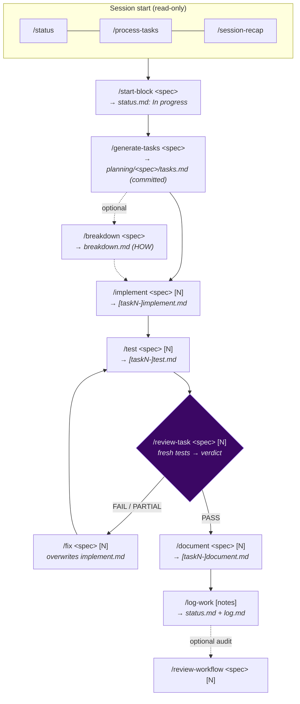
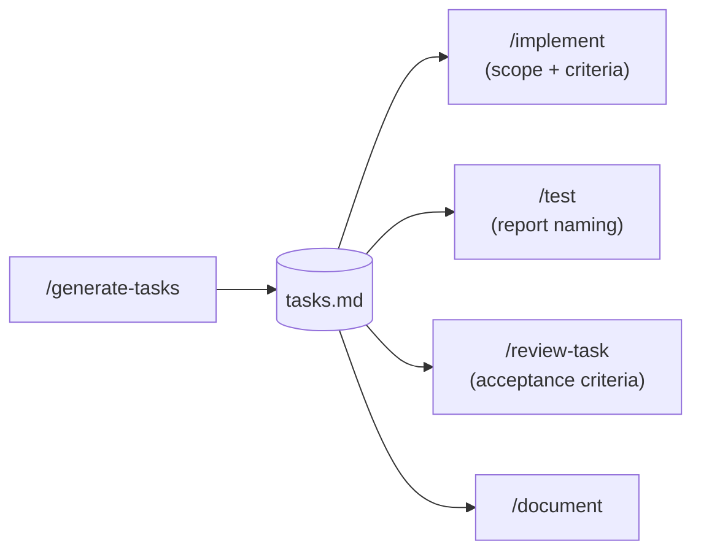

# Manual SDLC command lifecycle

The four engines ([`/sdlc-run`](sdlc-run.md), [`/sdlc-task`](sdlc-task.md), [`/sdlc-flow`](sdlc-flow.md), [`/sdlc-block`](sdlc-block.md))
**automate** the manual slash-command pipeline below. Run the commands by hand when you want a human
checkpoint between stages — inspect each report before proceeding, intervene, or cherry-pick stages.

Every step from Phase 2 onward takes the same argument form: `planning/<spec>/tasks.md [N]` (trailing
number = scope to task N; omit for the full spec — use the **same N** throughout, it names every report).

> The full per-command catalog (every flag, every input/output) lives in
> [`.claude/commands/README.md`](../../.claude/commands/README.md). This page is the **lifecycle view**:
> how the commands chain, what threads between them, and where the gates are.

---

## Lifecycle



| Phase | Command | Role | Output |
|---|---|---|---|
| Start | `/status` · `/process-tasks` · `/session-recap` | Orient: current focus, eligible specs, recent work | chat only |
| Block setup | `/start-block [spec]` | Flip the spec to `In progress` | `status.md` |
| **1 — Plan** | `/generate-tasks <spec>` | Author the full task spec from the master plan + commit it | `tasks.md` |
| 1 — Plan (ad-hoc) | `/chore` · `/ticket` · `/plan <desc>` | Plan work that isn't a master-plan block | `planning/<prefix>-<slug>/{tasks,plan}.md` |
| 1 — Plan (opt.) | `/breakdown <spec>` | Decompose the spec into atomic sub-steps (HOW) | `breakdown.md` |
| **2 — Implement** | `/implement <spec> [N]` | Execute the task(s); completeness self-check before commit | `[taskN-]implement.md` |
| 2 — Fix | `/fix <spec> [N]` | Targeted fixes for a FAIL/PARTIAL verdict (overwrites implement slot) | `[taskN-]implement.md` |
| 2 — Track | `/update-task [spec] <step> [note]` | Mark a step done / append a dated note | spec file (in place) |
| 2 — Commit | `/commit [hint]` | Stage + commit with a conventional message | git history |
| **3 — Test** | `/test <spec> [N]` | Run the `harness.json` validation suite; snapshot | `[taskN-]test.md` |
| **4 — Review** | `/review-task <spec> [N]` | Verify criteria + run **fresh** tests; issue verdict | `[taskN-]review.md` |
| **5 — Document** | `/document <spec> [N]` | Surgically patch `docs/`; **gated on PASS** | `[taskN-]document.md` |
| **6 — Wrap-up** | `/log-work [notes]` | Update `status.md` + append `log.md`; sync brain | `status.md`, `log.md` |
| **7 — Verify run** | `/review-workflow <spec> [N]` | Audit pipeline mechanics (reports, commits, log/status) | `[taskN-]workflow-review.md` |

---

## The spec file is the thread

`/generate-tasks` writes `planning/<spec>/tasks.md`; every command from `/implement` onward reads it.



- **`tasks.md` is authoritative for WHAT** (scope + acceptance criteria). When `/breakdown` has run,
  **`breakdown.md` is authoritative for HOW** (exact file paths, atomic change boundaries) — `/implement`
  and `/fix` auto-detect it and use the matching `### Step N:` section.
- **The `[N]` task number scopes the whole pipeline** to one task and prefixes every report `taskN-`. Use
  the same N at every step.

---

## Reports, directories, gates

Reports live at `planning/<spec>/sdlc/reports/`, named `[taskN-]<stage>.md`. Each stage reads the prior
stage's report as historical context; **only `/review-task` re-runs live tests** (authoritative).

```
planning/<spec>/
  tasks.md          ← /generate-tasks
  breakdown.md      ← /breakdown (optional)
  sdlc/reports/
    [taskN-]implement.md   test.md   review.md   document.md   workflow-review.md
```

| Gate | Enforced by | On failure |
|---|---|---|
| Review must PASS before Document | `/document` reads the review verdict | hard-stops on FAIL/PARTIAL |
| Fresh tests must pass for a PASS verdict | `/review-task` runs the gating checks live | a failed check forces FAIL/PARTIAL regardless of the code reading |
| Review report must exist + be non-PASS to run Fix | `/fix` reads the verdict | hard-stops if absent; soft-stops if already PASS |

---

## Ad-hoc work (no master-plan block)

For work outside the phase/block plan, generate a spec with an ad-hoc planner, then feed it into the same
Phase 2–6 pipeline (downstream commands derive report paths from the spec's parent directory, so a
`plan.md` spec flows through identically to a `tasks.md` one):

```
/chore <desc>    → planning/chore-<slug>/tasks.md   ─→ lean /sdlc-task (fast path)
/ticket <desc>   → planning/ticket-<slug>/tasks.md  ─→ lean /sdlc-task (fast path)
/plan <desc>     → planning/plan-<slug>/plan.md     ─→ /sdlc-block (multi-block)
                                                        or /generate-tasks --from + /sdlc-flow (single block)
```

---

## Worktree commands (manual isolation)

`/init-worktree` and `/clean-worktree` are the manual entry points to the isolated-worktree lifecycle
that [`/sdlc-task`](sdlc-task.md) and [`/sdlc-block`](sdlc-block.md) automate.

- **`/init-worktree <spec> [N]`** — derive a branch/worktree from the spec slug and create an isolated
  cone-mode sparse checkout. Open it as a new Claude Code session and run the pipeline (manual or
  `/sdlc-run`) inside it.
- **`/clean-worktree <branch>`** — **merge before delete**: fast-forward the branch into `main`, apply the
  deferred `status.md`/`log.md` updates from the task log, then remove the worktree and branch.

> Do **not** run `/clean-worktree` for `/sdlc-block` tasks — the orchestrator merges each wave for you.

---

## Choosing manual vs. automated

| Situation | Reach for |
|---|---|
| Step-by-step with a human checkpoint between stages | manual commands (this page) |
| Small tested change — a `/chore` or `/ticket` spec | [`/sdlc-task`](sdlc-task.md) |
| One task / full spec, sequential, no isolation | [`/sdlc-run`](sdlc-run.md) |
| Non-trivial feature work, branch-isolated, terminates in PR | [`/sdlc-flow`](sdlc-flow.md) |
| Drive a whole roadmap as a branch train of PRs | [`/sdlc-block`](sdlc-block.md) |
