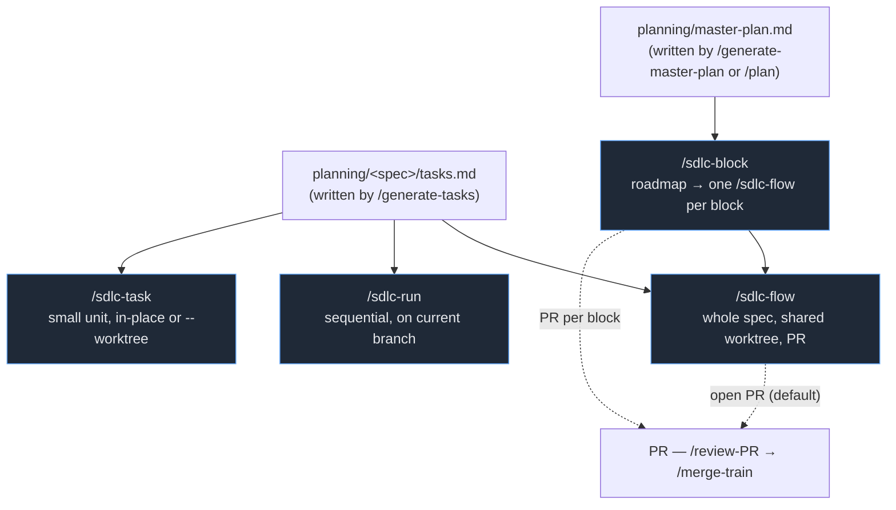

# SDLC Workflows

This is the canonical reference for the **harness's automated pipelines** — the `.claude/workflows/*.js`
engines that drive a spec from a `tasks.md` to merged, tested, documented code, and the manual
slash-command lifecycle they automate.

> **This lives here on purpose.** These engines are authored and evolved in `base-template` (the
> software-factory source). Downstream projects copy `.claude/` verbatim, so the workflows are
> identical everywhere — documenting them anywhere else would drift. When an engine changes, update the
> matching page here in the same change.

---

## The pipeline ladder

```
/patch          trivial hotfix · no tests · in-place
/sdlc-task      small tested change · implement→test→fix→commit · in-place or --worktree
/sdlc-run       full spec · sequential · in-place · no PR
/sdlc-flow      full spec · sequential · shared worktree · terminates in PR   ← default for non-trivial work
/sdlc-block     roadmap · one /sdlc-flow per block · branch train of PRs
```

## The four engines at a glance

| Engine | Scope | Isolation | Pairs with | You reach for it when… |
|---|---|---|---|---|
| [`/sdlc-task`](sdlc-task.md) | **one small unit** | in-place / `--worktree` | `/chore`, `/ticket` | small tested change — fast implement→test→commit |
| [`/sdlc-run`](sdlc-run.md) | one task **or** a full spec, **sequential** | none — runs on the current branch | `/generate-tasks` | sequential full pipeline on the current branch; resuming a spec |
| [`/sdlc-flow`](sdlc-flow.md) | **a whole spec**, **sequential** | its own git worktree (one shared for the whole spec) | `/generate-tasks` | **the default for non-trivial feature work** — sequential, conflict-free, terminates in a PR |
| [`/sdlc-block`](sdlc-block.md) | **a roadmap** (master-plan-format file) | per-block worktrees driving `/sdlc-flow` | `/generate-master-plan`, `/plan` | a whole roadmap fanned out as a branch train of reviewable PRs |

For step-by-step **manual** control (run `/implement`, then inspect, then `/test`, …), see the
[manual command lifecycle](commands.md). The engines automate exactly those commands.



- `/sdlc-flow` is the **default for non-trivial feature work**: one shared worktree eliminates
  inter-task merge conflicts; a single end-review over the integrated tree replaces per-task reviews;
  the terminal step is a PR.
- `/sdlc-block` is the **roadmap orchestrator**: it fans out one `/sdlc-flow` per independent block
  across dependency-ordered waves, producing a branch train of reviewable PRs.
- `/sdlc-task` is the **fast path** for small work: a real implement→test→fix loop but no
  review/document/wrap-up agents. Pairs with `/chore` and `/ticket`.
- `/sdlc-run` is the **sequential workhorse** when you don't need isolation or a PR.

---

## Shared concepts (true for all engines)

### Each stage is its own agent
Every pipeline stage runs as a **separate single-context agent**. Stages never share memory — they
communicate through committed files under `planning/<spec>/sdlc/`. That is what makes the pipeline
crash-recoverable and resumable: the committed files *are* the state.

### Committed state model

Each engine writes a committed JSON state file under `planning/<spec>/sdlc/`:

| Engine | State file | Status |
|---|---|---|
| `/sdlc-run` | `sdlc-run-state.json` | committed — phases + token roll-up (D37) |
| `/sdlc-task` | `sdlc-task-state.json` | committed — per-task status + token roll-up (D38) |
| `/sdlc-flow` | `sdlc-flow-state.json` | committed — authoritative run index; drives `--resume` (D31) |
| `/sdlc-block` | `block-orchestration-state.json` | committed — per-block status + child token roll-up (D39) |

`/sdlc-flow` also writes a human-readable `worklog.md` alongside its state file. The other engines
use per-stage report files (see below) as the primary resume signal; their state files are the
at-a-glance index and token accounting artifact.

### Report-file contract (sdlc-run / sdlc-task)
Reports are named `[taskN-]<stage>.md` under `sdlc/reports/`. `/sdlc-flow` does not use this
contract — it uses `sdlc-flow-state.json` + `worklog.md` instead (see
[D31](../../planning/decisions/D31-committed-authoritative-state.md)).

| Report | Written by | Read by |
|---|---|---|
| `[taskN-]implement.md` | implement (overwritten by each fix pass) | review, document |
| `[taskN-]test.md` | test | review |
| `[taskN-]review.md` | review | fix, document |
| `[taskN-]document.md` | document | — |
| `[taskN-]workflow.md` | wrap-up (sdlc-run) | humans, `/review-workflow` |
| `sdlc-flow-state.json` | `/sdlc-flow` state-writer ([D31](../../planning/decisions/D31-committed-authoritative-state.md)) | `--resume`, end-review localization, PR body — **committed** |
| `worklog.md` | `/sdlc-flow` state-writer ([D31](../../planning/decisions/D31-committed-authoritative-state.md)) | human-readable run trail — **committed** |

### The two hard gates
1. **Review gates Document** — `/document` refuses to run unless the review verdict is `PASS`.
2. **Fresh tests gate the PASS verdict** — review re-runs the *gating* validation checks itself; a
   failing check forces `FAIL`/`PARTIAL` no matter how clean the code reading was. A sloppy test report
   can never ship a bug.

### Validation is policy, not mechanism
No engine ships stack defaults. Each project declares its validation commands (and optional UI-test
stage) in [`planning/harness.json`](../harness-json.md). The test/review stages run exactly those
checks; absent a config they fall back to the spec's `## Validation Commands` block and disable the
UI-test stage. **Universal** rules stay hardcoded (no emoji in changed markdown, every change ships with
tests, parallel port = `port + taskNumber`).

### Model tiering — match the model to the work
> **Opus plans · Sonnet judges · Haiku does the mechanics.**

Each stage names its model in a `MODEL` map at the top of its engine. Without the map, every stage would
inherit the *session* model (launch from Opus → scout/test run on Opus too). A sharp spec + breakdown
makes implement/test/review well-scoped enough that Sonnet is reliable, so only spec authoring needs
Opus and the purely-procedural stages drop to Haiku.

| Tier | Stages | Why |
|---|---|---|
| **Opus** | `generate-tasks` (fallback), `enumerate-blocks` | planning / dependency-graph derivation — the leverage point |
| **Sonnet** | `implement`, `fix`, `triage`, `review`, `ui-test`, `document`, `wrap-up`, `pre-flight`, `PR` | judgment work |
| **Haiku** | `scout`, `worktree-setup`, `test`, `update-task`, `state-writers` | fixed procedures, no judgment |

**Staged escalation:** inside `/sdlc-run`, `/sdlc-task`, and `/sdlc-flow`, the *final* fix pass and
*final* review attempt run on `ESCALATION_MODEL` (`opus`). A hard task that has already failed gets one
strong shot before the pipeline wraps up `FAIL`. Set `ESCALATION_MODEL = null` to disable.

The real planning leverage is **upstream**: `/generate-tasks` and `/breakdown` run on your *session*
model, so author specs on an Opus session, then let the pipeline grind on Sonnet.

### The retry loop (max 3 attempts)
`implement → test → review →` `PASS: document` **or** `FAIL/PARTIAL: fix → test → review` (up to 3
review attempts — `/sdlc-run`). `/sdlc-flow` and `/sdlc-task` use a triage-gated bail instead of a
simple counter: triage classifies each failure as `RETRYABLE` or stuck, and stops early on stuck. Each
fix pass is its own commit, so the diff from each pass is auditable. After max failures the pipeline
wraps up `FAIL`.

---

## Token usage

Costs are dominated by stage count × model tier × spec size. Per-run token totals are recorded in
each engine's committed state file — check the state JSON for real figures from past runs.

| Workflow | Typical agents per run | Notes |
|---|---|---|
| `/sdlc-task` (one task, PASS first try) | ~4–6 | scout + implement + test + commit |
| `/sdlc-run` (one task, PASS first try) | ~6–8 | scout → implement → test → review → document → wrap-up |
| `/sdlc-flow` (5-task spec, PASS first try) | ~30–40 | worktree-setup + per-task update/implement/test + end-review + docs + wrap-up + PR |
| `/sdlc-block` (5-block roadmap) | N × `/sdlc-flow` + orchestration | dominated by child flow costs; roll-up in `block-orchestration-state.json` |

> **Token roll-up note:** all engines record **substantive-stages-only** totals — cheap Haiku helper
> agents (state writers, enumerate, update-task) are excluded. See
> [D37](../../planning/decisions/D37-unified-committed-state-and-telemetry.md).

---

## Pages

- **[sdlc-flow.md](sdlc-flow.md)** — the default for non-trivial feature work (D30). Shared worktree,
  per-task test-fix loop, triage-gated bail (D32), committed state model (D31), PR wrap-up (D33).
- **[sdlc-run.md](sdlc-run.md)** — the sequential engine. Parameters, `--from`, stages, resumption, gates.
- **[sdlc-task.md](sdlc-task.md)** — lean single-unit engine (D38). In-place or `--worktree`, implement→test→fix→commit, pairs with `/chore`/`/ticket`.
- **[sdlc-block.md](sdlc-block.md)** — roadmap orchestrator (D39/D40/D43). Pre-flight, enumerate-blocks, per-block `/sdlc-flow`, branch train, `/review-PR`, `/merge-train`.
- **[commands.md](commands.md)** — the manual command lifecycle the engines automate (Phase 1 → 7).

## Related

- [harness-json.md](../harness-json.md) — the `planning/harness.json` config the engines read.
- [`.claude/commands/README.md`](../../.claude/commands/README.md) — the command catalog.
- [`planning/decisions/`](../../planning/decisions/index.md) — the ADRs behind each behavior (D6–D43).
