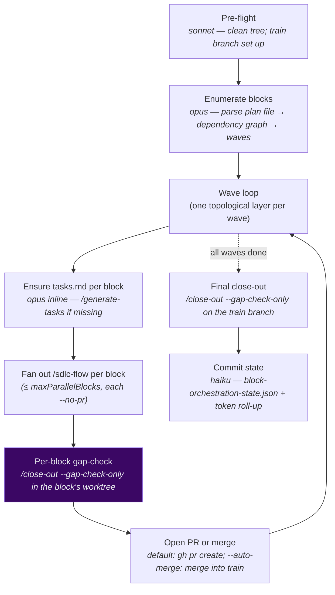

# `/sdlc-block` — block-level roadmap orchestrator

Reads a **master-plan-format file** (default `planning/master-plan.md`, or a path/slug arg),
parses it into phases and blocks with a dependency graph, and fans out **one `/sdlc-flow`
per independent block** across dependency-ordered waves — producing a **branch train of
reviewable PRs**. Phases run sequentially; blocks within a phase that share no dependency
run in parallel (up to `maxParallelBlocks`).

Think of it as **"one `/sdlc-flow` per block in your roadmap"**: the orchestrator handles the
dependency graph, the worktrees, and the PR-per-block train. You review with `/review-PR`
and land with `/merge-train`.

Engine: [`.claude/workflows/sdlc-block.js`](../../.claude/workflows/sdlc-block.js)

---

## Usage

```
/sdlc-block                                    use planning/master-plan.md
/sdlc-block my-plan                            slug → planning/my-plan/plan.md
/sdlc-block planning/plan-my-plan/plan.md      explicit path

/sdlc-block --base develop                     fork off + merge into 'develop'
/sdlc-block --auto-merge                       merge each block on completion (no PRs)
/sdlc-block --no-pr                            branch train only — no PRs
/sdlc-block --max-parallel-blocks 5            widen concurrency within a wave
/sdlc-block --blocks 0-1                       only phases 0 and 1
/sdlc-block --resume                           skip done blocks, continue
```

| Argument | Meaning | Default |
|---|---|---|
| `[plan-file]` | Optional 1st positional — a master-plan-format path, or a slug → `planning/<slug>/plan.md`. | `planning/master-plan.md` |
| `--base <branch>` | Base branch the train forks from / merges into. | `main` |
| `--auto-merge` | Merge each block into `<base>` in dependency order as it completes. No PRs opened. | off |
| `--no-pr` | Branch train only — no PRs opened anywhere. | off |
| `--max-parallel-blocks N` | Max `/sdlc-flow` runs in flight per wave. CLI overrides `harness.json` `block.maxParallelBlocks`. | `3` |
| `--blocks <sel>` | Phase selection: `0`, `0-1`, `0,2` — only those phases' blocks run. | all phases |
| `--resume` | Read `block-orchestration-state.json`, skip done blocks, continue. | off |

---

## The plan-file format

`/sdlc-block` reads any file that follows the master-plan format — `## Phase N` sections
containing `### Block X` sub-sections. Default ordering: **phases sequential, blocks
within a phase parallel**. Override with an explicit `- **Depends on:** Block <id>` line
inside a block definition.

```markdown
## Phase 0 — Foundation

### Block A — Shared types
...
### Block B — Config layer
...
- **Depends on:** Block A
```

`/generate-master-plan` authors this format. `/plan` writes a mini-roadmap in the same shape.
`/generate-tasks --from <path>` decomposes a single block into `tasks.md`.

---

## Phases



### Pre-flight
Runs once on the base branch. Creates the train branch (`<planSlug>-train` in default
PR mode; not needed for `--auto-merge` where blocks merge directly into `<base>`). Verifies
a clean tree and that the plan file is committed. Fails fast on a missing plan file.

### Enumerate blocks
An Opus agent parses the plan file into `[{phase, block, slug, dependsOn}]`. It synthesizes
the dependency graph: **phases sequential by default** (each block in phase N implicitly depends
on all phase N−1 blocks); `Depends on: Block <id>` lines add explicit intra-phase edges.
`computeWaves` lays out topological waves at block granularity — the same algorithm used for
task-level waves, now applied one level up.

### Wave loop

Per wave the orchestrator:

1. **Ensures `tasks.md`** — calls `/generate-tasks --from <block-section>` (Opus, inline
   agent) for any block that lacks a spec. This is the only place `/sdlc-block` authors specs;
   blocks that already have a `tasks.md` skip this step.

2. **Fans out `/sdlc-flow` per block** — each block runs in its own git worktree, each child
   flow passed `--no-pr` (the orchestrator owns PR timing). Up to `maxParallelBlocks` run
   concurrently per wave.

3. **Per-block gap-check** — for every block that completes with a PASS verdict:
   runs `/close-out --gap-check-only` in the block's worktree (coverage scan + docs patch,
   no handoff). A gap-check FAIL surfaces issues but does not block the orchestrator.

4. **Open PR or merge** — depends on mode:
   - **Default (PR mode):** opens one `gh pr create` per block. Records the PR number and
     branch in `block-orchestration-state.json`.
   - **`--auto-merge`:** merges the block branch into the train branch in dependency order;
     records the commit hash.
   - **`--no-pr`:** leaves branches only; `block-orchestration-state.json` records them for
     `/merge-train` later.

5. Advances the train to include all landed blocks before starting the next wave.

### Final close-out
After all waves: runs `/close-out --gap-check-only` over the full train branch — surfacing
any train-level coverage or doc gaps before human review of the PRs.

### Committed state
A Haiku state-writer commits `planning/<planSlug>/sdlc/block-orchestration-state.json`
after each wave. Keys: `plan_file`, `base_branch`, `train_branch`, `mode`
(`pr`/`auto-merge`/`no-pr`), `blocks` (per-block `slug`/`phase`/`status`/`branch`/
`pr_number`/`tokens`), `merge_order`, `tokens` (cumulative roll-up from all child flows).

---

## Resumption

Re-run `/sdlc-block [plan-file] --resume`. The orchestrator reads
`block-orchestration-state.json`, skips blocks whose status is `merged` or `pr-open`, and
resumes the remaining blocks. If a child `/sdlc-flow` was mid-run, pass `--resume` to it.

---

## After the train is built (default PR mode)

```
/review-PR <PR#>          spec-aware review: gating suite + emoji gate + AC check → verdict
/review-PR <PR#>          repeat for every block PR
/merge-train              merge the train bottom-up in recorded dependency order
```

`/review-PR` locates `block-orchestration-state.json` to resolve the block spec, checks out
the PR branch, runs the gating suite + emoji gate (merge-base scoped), reviews the diff against
the block's Acceptance Criteria, and posts an APPROVE/REQUEST_CHANGES/COMMENT verdict via
`gh pr review`.

`/merge-train` reads `merge_order` from the state file, classifies each PR (ready /
already-merged / needs-approval / has-conflicts / escalated), and merges them via
`gh pr merge --merge --delete-branch` in dependency order — halting on the first conflict.

---

## Token usage

Costs are dominated by the child `/sdlc-flow` runs (see [`sdlc-flow.md`](sdlc-flow.md)).
Orchestrator overhead is small:

| Stage | Model | Frequency |
|---|---|---|
| Pre-flight | sonnet | once |
| Enumerate blocks | opus | once |
| Ensure tasks.md (per missing block) | opus inline | per missing spec |
| `/sdlc-flow` child run | mixed | per block |
| `/close-out --gap-check-only` | sonnet | per block + once (final) |
| Open PR | sonnet | per block (default mode) |
| State write | haiku | after each wave |

Each child flow's `tokens.total` rolls up into `block-orchestration-state.json`. The cumulative
total across all blocks is in the top-level `tokens` key.

> **Note:** the token roll-up covers **substantive stages only** — cheap Haiku helper agents
> (state writers, gap-check summaries) are excluded from the per-block and cumulative totals.
> See [D37](../../planning/decisions/D37-unified-committed-state-and-telemetry.md).

---

## Relationship to the other engines

- **[`/sdlc-flow`](sdlc-flow.md)** — the inner engine; `/sdlc-block` invokes one per block.
- **[`/sdlc-run`](sdlc-run.md)** — sequential, no PR; use for a single spec on the current branch.
- **[`/sdlc-task`](sdlc-task.md)** — lean single-unit engine; pairs with `/chore` and `/ticket`.
- **`/review-PR`** — spec-aware PR review gate for a branch-train block.
- **`/merge-train`** — merges the train bottom-up in dependency order after review.
