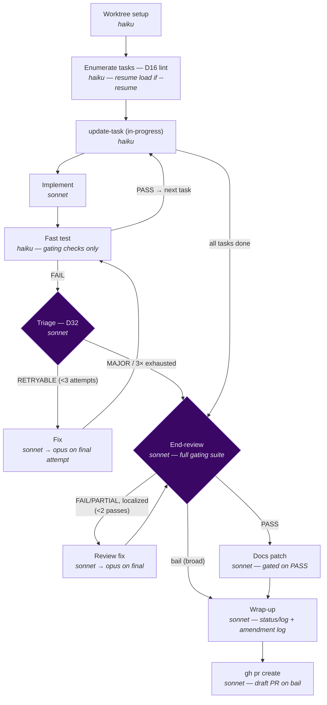

# `/sdlc-flow` — shared-worktree, PR-terminating SDLC engine

The default engine for non-trivial feature work. Runs every task in a spec **sequentially in one
shared worktree** — so there are no inter-task merge conflicts — with a per-task
`implement → fast-test → fix` loop, **one** consolidated review over the integrated tree at the end,
a surgical docs patch, and a **pull request** as the terminal step.

Compared with `/sdlc-block`, `/sdlc-flow` trades task-level parallelism for reliability: one
shared branch means zero inter-task merge conflicts, one end-review instead of a per-task pile, and
a PR handoff rather than an in-place landing. Compared with `/sdlc-run`, it is branch-isolated (its
own worktree) and terminates with a PR rather than committing directly to the current branch.

Engine: [`.claude/workflows/sdlc-flow.js`](../../.claude/workflows/sdlc-flow.js)

---

## Usage

```
/sdlc-flow <spec-slug>                         run every task in the spec, open a PR, stop
/sdlc-flow <spec-slug> 1-3                     scope to tasks 1 through 3
/sdlc-flow <spec-slug> 1,3,5                   scope to specific tasks
/sdlc-flow <spec-slug> 1-3,7                   range plus an extra task
/sdlc-flow <spec-slug> --tasks 1-7             explicit flag form (same as positional range)
/sdlc-flow <spec-slug> --auto-merge            merge the PR + clean the worktree on clean PASS
/sdlc-flow <spec-slug> --no-pr                 stop after wrap-up; do not create a PR
/sdlc-flow <spec-slug> --resume                re-attach the worktree; skip already-passed tasks
/sdlc-flow <spec-slug> --test-depth full       run the full gating suite per task (default: fast)
```

| Argument | Meaning | Default |
|---|---|---|
| `<spec-slug>` | **Required.** The spec directory name — drives every `planning/<spec-slug>/…` path. | — |
| `[range]` | Optional task selection as the 2nd positional token or via `--tasks`. Forms: `1-7`, `1,3,5`, `1-3,7`, `5`. | all tasks |
| `--tasks <range>` | Equivalent to the positional range. | — |
| `--auto-merge` | After a clean PASS, merge the PR and tear down the worktree/branch. Only fires on a non-draft PR with a PASS verdict — never on bail. | off |
| `--no-pr` | Stop after wrap-up; leave the branch for a manual PR. | off (create PR) |
| `--resume` | Re-attach the existing worktree and skip tasks whose `state.json` status is `passed`. | off |
| `--test-depth fast\|full` | Per-task validation depth. `fast` runs only `gates:true` checks (the tripwire); `full` runs the whole suite per task. | `fast` |

> All CLI flags override the corresponding `flow.*` config key in `planning/harness.json`. The config
> sets the per-project default; the flag overrides it for one run.

---

## Pipeline



| Stage | Model | What it does |
|---|---|---|
| **Worktree setup** | haiku | Creates (or re-attaches on `--resume`) one isolated git worktree for the whole spec. Branch name: `<spec>-flow`. Applies the D5/P5 cone-all-tracked-dirs recipe. Checks for unfilled tokens (D19 thin-spec guard) on a fresh run. |
| **Enumerate** | haiku | Reads `tasks.md` for `### N.` task headings (D16 preflight lint — refuses to run if none found). On `--resume`, reads the committed `sdlc-flow-state.json` to identify already-passed tasks and skip them. |
| **update-task** | haiku | Marks the current task in-progress in `tasks.md` (surgical checkbox edit). Does not commit — the state-writer commits it bundled with the state. |
| **Implement** | sonnet | Executes task N against the spec (and `breakdown.md` if present). Runs the D8 completeness self-check before committing `feat:`. |
| **Fast test** | haiku | Runs the `gates:true` checks from `harness.json` (the per-task tripwire). Falls back to the spec's `## Validation Commands` if no config. Also runs the universal emoji gate on changed markdown. |
| **Triage** | sonnet | Classifies a test failure as `RETRYABLE` (transient, or the failure changed — progress is possible) or `MAJOR` (an immediate-bail reason fires, or no progress). See [D32](../../planning/decisions/D32-triage-gated-bail.md). Bail means: break to end-review with `draft` flag. |
| **Fix** | sonnet | Targeted fix for the failing checks only — never a re-implement. Escalates to `opus` on the final attempt (`ESCALATION_MODEL`). |
| **End-review** | sonnet | ONE consolidated review over the integrated tree. Re-runs the **full** gating suite (authoritative). Reads `git diff <prBase>..HEAD` + `tasks.md` acceptance criteria + the committed `state.json` as the localization index. Verdict: `PASS` / `PARTIAL` / `FAIL`. |
| **Review fix** | sonnet | Bounded fix for localized end-review findings. Escalates to `opus` on the final pass. A broad or structural finding bails instead (triage decision). |
| **Docs patch** | sonnet | Surgical `--patch` of affected doc files. **Hard-gated on a PASS verdict.** Skipped entirely on bail. |
| **Wrap-up** | sonnet | Updates `status.md` + appends the `log.md` entry + writes D18 Amendment-Log entries — all **on the flow branch** (so they ride in the PR and merge atomically with the code). |
| **PR** | sonnet | Pushes the branch and runs `gh pr create --base <prBase>`. Builds the PR body from the committed `state.json` (per-task summary, verdict, open items). Opens a **draft** PR on bail. Degrades gracefully when `gh` is absent — prints the branch name and the exact commands. |

### Per-task retry loop

`update-task → implement → fast-test →` **PASS: next task** or **FAIL: triage →** `RETRYABLE: fix →
fast-test` (up to **3 total attempts**), or `MAJOR: bail to end-review`. The final fix attempt
escalates to `opus`. Exhausting the attempt cap also bails.

### End-review fix loop

`end-review →` **PASS: docs** or **FAIL/PARTIAL (localized): review fix → end-review** (up to
**2 fix passes**, `opus` on the last). A broad or structural finding from triage skips the fix loop
and bails straight to wrap-up (draft PR).

---

## Committed-state model (D31)

`/sdlc-flow` deliberately inverts the harness's usual rule about state files. In the other engines,
per-stage report files are authoritative and the D27/D28 JSON breadcrumbs are gitignored. In
`/sdlc-flow`, there is one writer, one branch, and sequential tasks — so a compact committed state
replaces the 5 × N report files:

| File | Location | Status | Purpose |
|---|---|---|---|
| `sdlc-flow-state.json` | `planning/<spec>/sdlc/` | **committed** — NOT gitignored | Authoritative run index. Drives `--resume`, feeds the end-review as a localization map, and lets wrap-up build the PR body. |
| `worklog.md` | `planning/<spec>/sdlc/` | **committed** — NOT gitignored | Human-readable trail. One short section per task/phase: what completed, issues hit, how resolved, decisions. |

`state.json` keys: `spec_slug`, `branch`, `worktree_path`, `started_at`, `updated_at`,
`status` (`running|review|docs|wrapup|blocked|done`), `current_task`, `tasks` (per-task
`status/attempts/summary/issues/fixes/decisions/files_changed/commit/validated`), `review`
(`verdict/findings/attempts`), `docs` (`changed/created`), `bail_reason`, `pr` (`url/number`),
`tokens` (per-task and per-stage token usage + cumulative `total`).

> **Token roll-up note:** `tokens.total` covers substantive stages (implement, test, fix, review,
> docs, wrap-up). Cheap Haiku helper agents (state writers, enumerate, update-task) are excluded.
> See [D37](../../planning/decisions/D37-unified-committed-state-and-telemetry.md).

A **Haiku state-writer agent** stamps `started_at`/`updated_at` and commits both files (bundled
with the `tasks.md` checkbox edit) in one `chore: flow state — <label>` commit per task/phase.
This keeps the branch self-describing in the PR.

**The state is the index, never a substitute for verification.** The end-review is fed `state.json`
but must still read `git diff <prBase>..HEAD` + `tasks.md` criteria directly and re-run the full
gating suite. State speeds localization; it does not get to assert correctness.

---

## Policy — `flow.*` config keys

The engine ships **no stack defaults**. Per-project defaults live in `planning/harness.json` under
the `flow` block. Every key has a CLI flag that overrides it for a single run.

| `flow` key | Type | CLI override | Default | Meaning |
|---|---|---|---|---|
| `autoMerge` | boolean | `--auto-merge` | `false` | Merge the PR and tear down the worktree on clean PASS (non-draft only). |
| `testDepth` | `"fast"` \| `"full"` | `--test-depth` | `"fast"` | Per-task validation depth. `fast` = gating checks only (tripwire); `full` = whole suite per task. |
| `prBase` | string | — | `"main"` | Base branch for `gh pr create`. |
| `bailReasons` | string[] | — | `[]` | Extra project-specific immediate-bail reasons appended to the universal five. |

**Universal bail reasons** (hardcoded — mechanism, not policy):

1. Missing/undefined upstream dependency or symbol the spec assumes exists.
2. Spec ambiguity/contradiction — intended behavior is genuinely undeterminable.
3. Environment/credential/auth/network failure (not a code defect).
4. Change would require a destructive or out-of-scope action.
5. Same failure twice with no progress (stuck), or a structural design flaw needing a re-plan.

Projects append project-specific reasons via `flow.bailReasons[]`. The triage agent's bias is
**when unsure, bail** — a wasted retry loop costs more than one human glance at a draft PR. See
[D32](../../planning/decisions/D32-triage-gated-bail.md).

---

## Model tiering

> Opus plans · Sonnet judges · Haiku does the mechanics.

| Tier | Stages | Why |
|---|---|---|
| **haiku** | worktree-setup, enumerate, state-load, update-task, test, state-writer | Fixed procedures — no judgment required |
| **sonnet** | implement, fix, triage, review, review-fix, docs, wrap-up, PR, merge | Judgment work — reading and writing code/prose |
| **opus (escalation)** | final per-task fix attempt, final review fix pass | Hard tasks that already failed; one strong shot before bail |
| **opus (planning fallback)** | `generate-tasks` if the spec is missing | Spec authoring — the leverage point |

To re-tier a stage, change one value in the `MODEL` map at the top of
`.claude/workflows/sdlc-flow.js`. Nothing else moves.

---

## Commit strategy

All commits land on the `<spec>-flow` branch. The PR body is built from the committed state.

| Commit | Agent | When |
|---|---|---|
| `chore: init worktree <branch>` | worktree-setup | Once, at branch creation |
| `feat: implement <stem> task N` | implement | Per task, attempt 1 |
| `fix: fix pass P for <stem> task N` | fix | Per task, fix attempt P |
| `chore: flow state — <label>` | state-writer | Per task/phase (bundles state.json + worklog.md + checkbox) |
| `docs: update docs for <spec>` | docs | After PASS verdict |
| `chore: wrap up <spec>` | wrap-up | Final commit before PR |

---

## Resumption

Pass `--resume` after an interruption. The engine re-attaches the existing worktree, reads the
committed `sdlc-flow-state.json`, and skips every task whose status is `passed`. Tasks whose
status is `running` or `failed` are retried from scratch.

| State | On `--resume` |
|---|---|
| `state.json` absent | Runs all selected tasks fresh |
| Task N status `passed` | Skipped |
| Task N status `running` / `failed` | Retried from implement |
| `bail_reason` set | Logged; end-review proceeds immediately |

Because `state.json` is committed, a forced kill never loses progress — the last successful task's
state is in git history.

---

## Which engine when

| Engine | Reach for it when |
|---|---|
| `/patch` | Trivial hotfix with no tests needed. |
| `/sdlc-task` | Small tested change — a `/chore` or `/ticket` spec. Fast implement → test → commit. |
| `/sdlc-run` | One task or a full spec on the current branch — no isolation or PR needed. |
| `/sdlc-flow` | **Default for non-trivial feature work** — sequential, conflict-free, terminates in a PR. |
| `/sdlc-block` | A whole roadmap — fans out one `/sdlc-flow` per independent block, branch train of PRs. |

---

## Token usage

| Stage | Model | Typical tokens |
|---|---|---|
| worktree-setup | haiku | _TBD_ |
| enumerate | haiku | _TBD_ |
| update-task (per task) | haiku | _TBD_ |
| implement (per task) | sonnet | _TBD_ |
| fast test (per task) | haiku | _TBD_ |
| triage (per failure) | sonnet | _TBD_ |
| fix (per pass) | sonnet | _TBD_ |
| end-review | sonnet | _TBD_ |
| docs | sonnet | _TBD_ |
| wrap-up | sonnet | _TBD_ |
| PR | sonnet | _TBD_ |
| **Full run (5 tasks, PASS first try)** | — | _TBD_ (~30–40 agents) |

Fill these cells from measured runs via the `tracedAgent` telemetry in each run's `worklog.md`.
Levers: a sharp spec + breakdown cuts implement tokens; clean first-try tests avoid the fix loop;
clean end-review avoids the review-fix loop.
