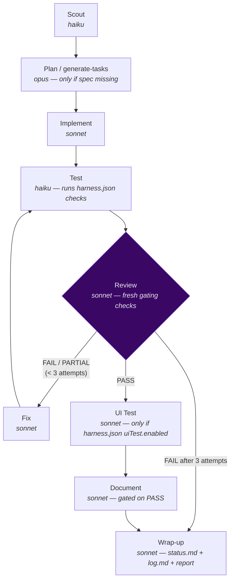

# `/sdlc-run` — sequential SDLC pipeline

Runs the full SDLC pipeline for a spec **from its current stage to completion**, on the **current
branch** (usually `main`). No worktree is created; each stage commits its own work, and the wrap-up
stage updates `status.md` + `log.md` directly. It is the simplest engine — use it when you don't
need branch isolation or a PR handoff.

Engine: [`.claude/workflows/sdlc-run.js`](../../.claude/workflows/sdlc-run.js)

---

## Usage

```
/sdlc-run <spec-slug>                   run every task in the spec, sequentially
/sdlc-run <spec-slug> 2                 scope every stage to task 2 only
/sdlc-run <spec-slug> --from implement  skip the scout; start at the named stage
/sdlc-run <spec-slug> 2 --from test     task-scoped + skip the scout
```

| Argument | Meaning | Default |
|---|---|---|
| `<spec-slug>` | **Required.** The spec directory name — drives every `planning/<spec-slug>/…` path. | — |
| `[N]` (2nd positional) | Optional task number. Scopes **every** stage to task N and prefixes every report `taskN-`. Omit for a full-spec run. | all tasks |
| `--from <stage>` | Skip the scout and start at the named stage (the caller already knows the resume point). Valid: `implement`, `fix`, `test`, `review`, `ui-test`, `document`, `wrap-up`. | scout decides |

---

## Pipeline



| Stage | Model | What it does |
|---|---|---|
| **Scout** | haiku | Reads which report files exist (+ `status.md`, recent log) and applies a fixed priority order to pick the start stage. Skipped entirely when `--from` is given. |
| **Plan** | opus | `generate-tasks` — authors the spec from `master-plan.md`. **Fallback only**: fires when `tasks.md` is missing; normally the spec already exists and this is skipped. |
| **Implement** | sonnet | Executes the task(s) against the spec (and `breakdown.md` if present). Runs a completeness self-check ([D8](../../planning/decisions/D8-implement-completeness-self-check.md)) before committing `feat:`/`fix:`. |
| **Test** | haiku | Runs the project's validation suite from `harness.json` (`validation.checks[]`, incl. richer [D6](../../planning/decisions/D6-harness-richer-checks.md)/[D26](../../planning/decisions/D26-sdlc-run-d6-parity.md) check kinds) + the universal emoji gate. Reads exit codes; writes `test.md`. |
| **Review** | sonnet | Re-runs the **gating** checks itself (authoritative) and verifies every acceptance criterion. Verdict `PASS`/`PARTIAL`/`FAIL` gates the next stage. |
| **Fix** | sonnet | Targeted fixes for the failing criteria only — never a re-implement. Overwrites the `implement.md` slot, then loops back to Test. |
| **UI Test** | sonnet | Live browser smoke check via playwright-cli. **Skipped** unless `harness.json` `uiTest.enabled` is true (config absent → skipped). Auto-skips for docs-only changes. |
| **Document** | sonnet | Surgically patches `docs/*.md` for the changed source. **Hard-gated** on a `PASS` verdict. |
| **Wrap-up** | sonnet | Updates `status.md` + appends the `log.md` entry + writes `workflow.md`, then one `chore:` commit. Merged log-work + finalize into one agent ([D14](../../planning/decisions/D14-sdlc-task-agent-consolidation.md)); applies any spec Amendment-Log deviations on `main` ([D18](../../planning/decisions/D18-living-artifact-specs.md)). |

### Retry loop
`implement → test → review →` **PASS** → document, or **FAIL/PARTIAL** → `fix → test → review`, up to
**3 review attempts**. The final fix pass and final review attempt escalate to `opus`
(`ESCALATION_MODEL`). After 3 failures the pipeline skips Document and wraps up `FAIL`.

---

## Commit strategy

Each agent commits its own work immediately, so a mid-run crash leaves all completed work in git:

| Stage | Commit prefix |
|---|---|
| Implement | `feat: implement <stem>` (`fix:` if validation failed) |
| Fix (per pass) | `fix: fix pass N for <stem>` |
| Document | `docs: update docs for <stem>` |
| Wrap-up | `chore: wrap up <stem>` (status.md, log.md, reports) |

---

## Resumption

Re-run the **same command** after an interruption. The scout reads the committed reports and resumes at
the first incomplete stage; reports are authoritative, the log is a cross-reference sanity check.

| Reports present | Scout resumes at |
|---|---|
| none (no spec) | `generate-tasks` |
| none (spec exists) | `implement` |
| `implement.md` | `test` |
| `implement.md` + `test.md` | `review` |
| `review.md` = FAIL/PARTIAL | `fix` |
| `review.md` = PASS | `document` |
| `document.md` | `wrap-up` |

A committed `sdlc-run-state.json` is written after each phase — a compact, machine-readable
index of what's in flight (current phase, completed phases, token usage). It lives under
`planning/<spec>/sdlc/` and is swept into the final `chore:` wrap-up commit. The committed
reports remain the authoritative resume signal; `sdlc-run-state.json` is the at-a-glance index
and the token-accounting artifact. See [D37](../../planning/decisions/D37-unified-committed-state-and-telemetry.md).

---

## When to use it

- A single task or a full spec where **no branch isolation** is needed.
- **Resuming** a partially-completed spec — the scout picks up where the reports left off.

Reach for [`/sdlc-flow`](sdlc-flow.md) when you want branch isolation and a PR handoff.
Reach for [`/sdlc-task`](sdlc-task.md) for small tested work (`/chore`/`/ticket`).
Reach for [`/sdlc-block`](sdlc-block.md) to drive a whole roadmap as a branch train.

---

## Token usage

| Stage | Model | Typical tokens |
|---|---|---|
| scout | haiku | _TBD_ |
| generate-tasks (fallback) | opus | _TBD_ |
| implement | sonnet | _TBD_ |
| test | haiku | _TBD_ |
| review | sonnet | _TBD_ |
| fix (per pass) | sonnet | _TBD_ |
| document | sonnet | _TBD_ |
| wrap-up | sonnet | _TBD_ |
| **Full run (one task, PASS first try)** | — | _TBD_ (~6–8 agents) |

Levers: a sharp upstream spec keeps the pipeline on Sonnet (no escalation); a clean first-try review
avoids the fix→test→review cycles (each adds ~3 agents). Per-stage token usage is recorded in
`sdlc-run-state.json` after each phase — check the committed state file for measured figures.
