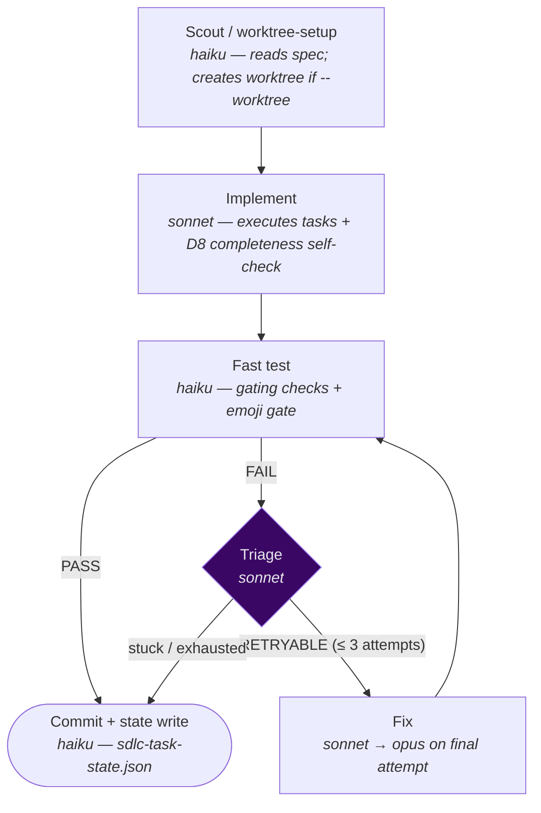

# `/sdlc-task` — lean single-unit SDLC engine

The fast path for **one small unit of behavior-changing work**. Runs
`implement → fast-test → triage → fix (≤3 attempts, Opus on the final) → commit`,
either in-place on the current branch (default) or in an isolated worktree (`--worktree`).

Think of it as the middle rung of the pipeline ladder — more ceremony than `/patch` (real test
loop), less than `/sdlc-run` (no review/document/wrap-up agents). Pairs with `/chore` and
`/ticket`.

Engine: [`.claude/workflows/sdlc-task.js`](../../.claude/workflows/sdlc-task.js)

---

## Usage

```
/sdlc-task <spec-slug>              run the whole spec in-place on the current branch
/sdlc-task <spec-slug> 1-3          scope to tasks 1 through 3
/sdlc-task <spec-slug> --worktree   isolated worktree (defer status/log to merge)
/sdlc-task <spec-slug> --resume     re-attach existing worktree + continue
```

| Argument | Meaning | Default |
|---|---|---|
| `<spec-slug>` | **Required.** The spec directory name — drives every `planning/<spec-slug>/…` path. | — |
| `[range]` | Optional task selection (positional or `--tasks`). Forms: `1-3`, `1,3,5`, `5`. | all tasks |
| `--worktree` | Create an isolated worktree. Status/log are deferred to `/clean-worktree` at merge time. | off (in-place) |
| `--resume` | Re-attach the existing worktree and continue from the last committed state. | off |

---

## Pipeline



| Stage | Model | What it does |
|---|---|---|
| **Scout / worktree-setup** | haiku | Reads the spec and existing report state (for `--resume`). With `--worktree`, creates `trees/<branch>/` via cone-mode sparse checkout (all tracked top-level dirs — no stack assumptions, per [D5](../../planning/decisions/D5-okf-phase-2-adopted.md)). |
| **Implement** | sonnet | Executes every task (or the selected range) against `tasks.md` (and `breakdown.md` if present). Runs the [D8](../../planning/decisions/D8-implement-completeness-self-check.md) completeness self-check before committing `feat:`/`fix:`. |
| **Fast test** | haiku | Runs the `gates:true` checks from `harness.json` plus the universal emoji gate on changed markdown. Falls back to the spec's `## Validation Commands` if no config. |
| **Triage** | sonnet | Classifies a failing test as `RETRYABLE` (transient, or failure changed — progress is possible) or stuck (same criteria twice, or structural). Stuck → commit the current state as `FAIL` and exit. |
| **Fix** | sonnet | Targeted fix for the failing checks only — never a re-implement. Escalates to `opus` on the final attempt (`ESCALATION_MODEL`). |
| **Commit + state** | haiku | Writes `sdlc-task-state.json` (per-task status + token usage) and commits all work + state. In-place: one final `chore:` commit. `--worktree`: one commit per phase write (throwaway branch, applied at merge). |

### The retry loop

`implement → fast-test →` **PASS: commit** or **FAIL: triage →** `RETRYABLE: fix → test`
(up to **3 total attempts**). The final fix attempt escalates to `opus`. After 3 failures or a
stuck triage verdict, the engine commits the current state and exits cleanly with a `FAIL`
status.

---

## Committed state

`/sdlc-task` writes a committed `sdlc-task-state.json` under `planning/<spec>/sdlc/`:

```json
{
  "spec_slug": "ticket-login-fix",
  "status": "done",
  "tasks": [
    { "task": 1, "status": "pass", "tokens": { "implement": 45000, "test": 1200, "total": 46200 } }
  ],
  "tokens": { "total": 46200 }
}
```

In-place mode: written once, swept into the final `chore:` commit alongside `status.md` and
`log.md` updates. `--worktree` mode: written per-phase, committed to the worktree branch and
applied at `/clean-worktree` merge time.

> **Token roll-up note:** `tokens.total` covers substantive stages (implement, test, fix).
> Cheap Haiku helper agents are excluded. See [D37](../../planning/decisions/D37-unified-committed-state-and-telemetry.md).

---

## In-place vs. `--worktree`

| | In-place (default) | `--worktree` |
|---|---|---|
| Branch | current branch (usually `main`) | `trees/<spec>-task/` |
| Status/log | updated on the current branch | deferred to `/clean-worktree` |
| State commit | one final `chore:` sweep | per-phase, into the worktree branch |
| When to use | small work; single session | parallel sessions; keep `main` clean |

### `--worktree` merge flow

```mermaid
sequenceDiagram
    participant T as Task session (trees/&lt;branch&gt;/)
    participant M as Main session
    T->>T: implement → test → commit (state written per phase)
    M->>M: /clean-worktree &lt;branch&gt;
    M->>M: git merge --ff-only &lt;branch&gt;
    M->>M: apply deferred status.md + log.md updates
    M->>M: git worktree remove + branch -D
```

---

## When to use it

Reach for `/sdlc-task` when:
- A `/chore` or `/ticket` planner just ran — both route here by default.
- The work is **small, self-contained, and needs real tests** — but doesn't warrant a full
  review/document/wrap-up cycle.
- You want the fast path: implement → test → commit, with a real fix loop.

| Engine | Reach for it when |
|---|---|
| `/patch` | Trivial hotfix with no tests needed |
| `/sdlc-task` | **Small tested change** — `/chore` or `/ticket` work |
| `/sdlc-run` | Full spec with review/document/wrap-up, on the current branch |
| `/sdlc-flow` | Non-trivial feature work with a PR handoff |
| `/sdlc-block` | Whole roadmap — one `/sdlc-flow` per block, branch train |

---

## Token usage

| Stage | Model | Typical tokens |
|---|---|---|
| scout / worktree-setup | haiku | _TBD_ |
| implement | sonnet | ~45–60k |
| fast test | haiku | _TBD_ |
| triage (per failure) | sonnet | ~4–6k |
| fix (per pass) | sonnet | _TBD_ |
| commit + state | haiku | _TBD_ |
| **Full run (one task, PASS first try)** | — | _TBD_ (~4–6 agents) |

Measured totals persist in the committed `sdlc-task-state.json` — check that file for
real figures from past runs.
